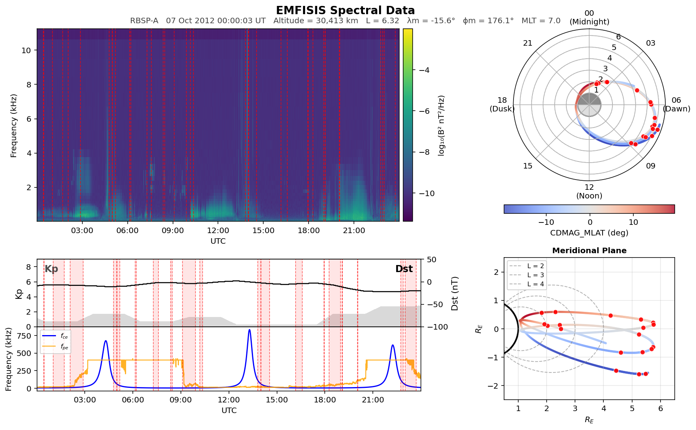
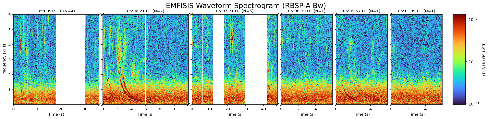
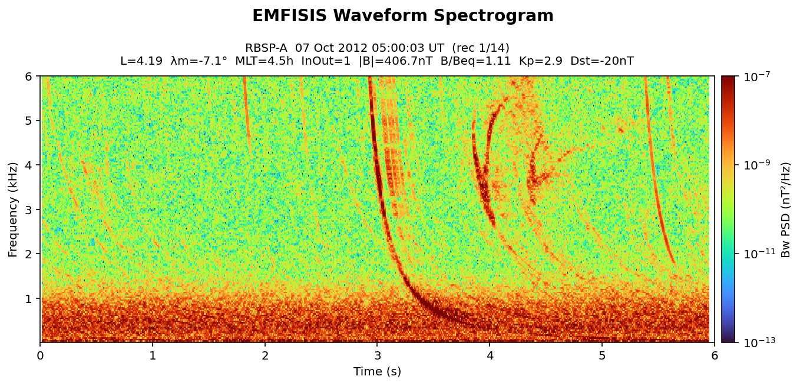

# RBSP Data Analysis Dashboard

## Project Description

Analysis and Visualization tool ... (TBD) 

## Data Visualization

This dashboard provides multiple visualization modes for analyzing **EMFISIS** data from the Van Allen Probes (RBSP-A / RBSP-B) given a start time and end time. It integrates:

- **EMFISIS spectral data** (wave power density)
- **EMFISIS burst waveform data**
- **MagEphem data** (MLT, L-shell, magnetic latitude, spacecraft location)
- **HFR data** for estimating local electron plasma frequency (`f_pe`)

This code plots EMFISIS data from the Van Allen Probe. It also uses MagEphem data for the MLT plots and spacecraft locations and the HFR data for f_pe. Below is the plot.



The code can generate a **combined continuous burst waveform view**, which stitches together burst-mode waveform records into a time-ordered visualization. It makes it easier to scan through different times of a file and visually inspect for whistler waves.



A high-resolution spectrogram can be generated for an individual burst waveform. As of v0, it plots only the first burst in the file. but it can be extended to plot individual bursts that are of interest.



## Potential To Do's

- Introduce classification scripts to automatically identify the type of wave.
- Get more info from data for classification
- Add event tagging and saving of candidate bursts
- Enable burst selection by time or event metadata
- Integrate statistical summaries (occurrence rate vs L-shell / MLT)
- Add batch processing for multi-day datasets

## Folder Directory

Expected data folder structure in the root directory:

```
<ROOT_DIR>/
├─ RBSP-A/ or RBSP-B/
│  ├─ L2/
│  │  └─ YYYY/
│  │     └─ MM/
│  │        └─ DD/
│  │           ├─ rbsp-a_HFR-waveform_emfisis-L2_YYYYMMDD_vX.X.X.cdf
│  │           ├─ rbsp-a_HFR-waveform-continuous-burst_emfisis-L2_YYYYMMDDT00_vX.X.X.cdf
│  │           ├─ rbsp-a_HFR-spectra_emfisis-L2_YYYYMMDD_vX.X.X.cdf
│  │           ├─ rbsp-a_WFR-waveform-continuous-burst_emfisis-L2_YYYYMMDDT00_vX.X.X.cdf
│  │           ├─ rbsp-a_WFR-spectral-matrix_emfisis-L2_YYYYMMDD_vX.X.X.cdf
│  │           ├─ rbsp-a_magnetometer_uvw_emfisis-L2_YYYYMMDD_vX.X.X.cdf
│  │           └─ ... (other EMFISIS L2 CDF products for that day)
│  └─ MagEphem/
│     └─ YYYY/
│        └─ MM/
│           └─ DD/
│              ├─ rbspa_def_MagEphem_OP77Q_YYYYMMDD_v3.0.0.h5
│              ├─ rbspa_def_MagEphem_OP77Q_YYYYMMDD_v3.0.0.txt
│              ├─ rbspa_def_MagEphem_T89D_YYYYMMDD_v3.0.0.h5
│              ├─ rbspa_def_MagEphem_T89D_YYYYMMDD_v3.0.0.txt
│              ├─ rbspa_def_MagEphem_T89Q_YYYYMMDD_v3.0.0.h5
│              ├─ rbspa_def_MagEphem_T89Q_YYYYMMDD_v3.0.0.txt
│              ├─ rbspa_def_MagEphem_TS04D_YYYYMMDD_v3.0.0.h5
│              └─ rbspa_def_MagEphem_TS04D_YYYYMMDD_v3.0.0.txt
```

## Data Description

### EMFISIS Spectral Data
Frequency-domain magnetic field measurements with columns for each frequency band (freq_0 through freq_64). These spectral matrices contain the power density across frequency bins.

<details>
<summary><b>View available spectral channels</b></summary>

```
freq_0, freq_1, freq_2, freq_3, freq_4, freq_5,
freq_6, freq_7, freq_8, freq_9, freq_10, freq_11,
freq_12, freq_13, freq_14, freq_15, freq_16, freq_17,
freq_18, freq_19, freq_20, freq_21, freq_22, freq_23,
freq_24, freq_25, freq_26, freq_27, freq_28, freq_29,
freq_30, freq_31, freq_32, freq_33, freq_34, freq_35,
freq_36, freq_37, freq_38, freq_39, freq_40, freq_41,
freq_42, freq_43, freq_44, freq_45, freq_46, freq_47,
freq_48, freq_49, freq_50, freq_51, freq_52, freq_53,
freq_54, freq_55, freq_56, freq_57, freq_58, freq_59,
freq_60, freq_61, freq_62, freq_63, freq_64
```

</details>

### EMFISIS Waveform Data
Raw time-series amplitude samples from burst mode observations at high sampling rates. Provides detailed high-resolution measurements of electromagnetic waves.

<details>
<summary><b>View data structure</b></summary>

- **Time series format**: Multiple records per file at high sampling rates (typically kHz range)
- **Records**: Each burst contains multiple records with consistent number of samples per record
- **Components**: Magnetic field amplitude data (Bw - waveform data)
- **Metadata**: Timestamp, sampling frequency, record count, samples per record

</details>

### MagEphem (Magnetic Ephemeris) Data
Satellite position, trajectory, and magnetic field parameters computed from external and internal magnetic field models. Includes spatial coordinates, magnetic Field values, and invariant parameters commonly used in magnetospheric research.

<details>
<summary><b>View key parameters</b></summary>

**Position & Coordinates:**
- Spatial: `Rsm_0`, `Rsm_1`, `Rsm_2`, `Rgeo_0`, `Rgeo_1`, `Rgeo_2`
- Geomagnetic: `CDMAG_MLAT`, `CDMAG_MLT`, `CDMAG_R`, `EDMAG_MLAT`, `EDMAG_MLT`, `EDMAG_R`
- Geodetic: `Rgeod_Height`, `Rgeod_LatLon_0`, `Rgeod_LatLon_1`

**Magnetic Field Parameters:**
- Field values: `Bfn_geo`, `Bfn_gsm`, `Bfs_geo`, `Bfs_gsm`, `Bm`, `Bsc_gsm`
- Invariants: `Lsimple`, `L_0` through `L_17`, `Lstar_0` through `Lstar_17`, `InvLat`, `InvLat_eq`
- Adiabatic: `Kappa_0` through `Kappa_17`, `I_0` through `I_17`, `K_0` through `K_17`
- Loss cone: `Loss_Cone_Alpha_n`, `Loss_Cone_Alpha_s`

**Event & Diagnostic:**
- Time: `IsoTime`, `UTC`, `JulianDate`, `GpsTime`
- Geomagnetic indices: `Dst`, `Kp`, `DipoleTiltAngle`
- Model info: `IntModel`, `ExtModel`, `FieldLineType`, `DriftShellType_0` through `DriftShellType_17`
- Geometry: `RadiusOfCurv`, `BoverBeq`, `MlatFromBoverBeq`, `OrbitNumber`, `Doy`

</details>

## References

Sonwalkar, V. S., & Reddy, A. (2024). Specularly reflected whistler: A low-latitude channel to couple lightning energy to the magnetosphere. Science Advances, 10(33), eado2657. https://doi.org/10.1126/sciadv.ado2657

Reddy, A., Sonwalkar, V. S., & Huba, J. D. (2018). Evolution of Field‐Aligned Electron and Ion Densities From Whistler Mode Radio Soundings During Quiet to Moderately Active Period and Comparisons With SAMI2 Simulations. Journal of Geophysical Research: Space Physics, 123(2), 1356–1380. https://doi.org/10.1002/2017JA024348

Reddy, A., & Sonwalkar, V. (2025).  IMAGE Observations of “Patchy” Specularly Reflected Whistler Mode Echoes: A
New Diagnostic Tool for Large-scale Field-aligned Irregularities. In Proceedings of the URSI Atlantic Radio Science Meeting (AP25). URSI. https://doi.org/10.46620/URSIAPRASC25/BZEG3045

Sonwalkar, V. S., Carpenter, D. L., Bell, T. F., Spasojević, M., Inan, U. S., Li, J., Chen, X., Venkatasubramanian, A., Harikumar, J., Benson, R. F., Taylor, W. W. L., & Reinisch, B. W. (2004). Diagnostics of magnetospheric electron density and irregularities at altitudes <5000 km using whistler and Z mode echoes from radio sounding on the IMAGE satellite. Journal of Geophysical Research: Space Physics, 109(A11), 2004JA010471. https://doi.org/10.1029/2004JA010471

Sonwalkar, V. S., Reddy, A., & Carpenter, D. L. (2011). Magnetospherically reflected, specularly reflected, and backscattered whistler mode radio-sounder echoes observed on the IMAGE satellite: 2. Sounding of electron density, ion effective mass (meff), ion composition (H+, He+, O+), and density irregularities: WM RADIO SOUNDING OF ELECTRONS AND IONS. Journal of Geophysical Research: Space Physics, 116(A11), n/a-n/a. https://doi.org/10.1029/2011JA016760

Reddy, A. (2007). Occurrence patterns of whistler mode (WM) echoes observed by RPI/IMAGE and their relation to geomagnetic activity (Master’s thesis). University of Alaska Fairbanks.

Reddy, A. (2015). Variation of the plasmaspheric field-aligned electron density and ion composition as a function of geomagnetic storm activity (Doctoral dissertation). University of Alaska Fairbanks.

## Interesting Papers to Read

Sen Gupta, A., Kletzing, C., Howk, R., Kurth, W., & Matheny, M. (2017). Automated identification and shape analysis of chorus elements in the Van Allen radiation belts. Journal of Geophysical Research: Space Physics, 122, 12,353–12,369. https://doi.org/10.1002/2017JA023949

Horne, R., Thorne, R., Shprits, Y. et al. Wave acceleration of electrons in the Van Allen radiation belts. Nature 437, 227–230 (2005). https://doi.org/10.1038/nature03939

Li, X., D. N. Baker, H. Zhao, K. Zhang, A. N. Jaynes, Q. Schiller, S. G. Kanekal, J. B. Blake, and M. Temerin (2017), Radiation belt electron dynamics at low L (<4): Van Allen Probes era versus previous two solar cycles, J. Geophys. Res. Space Physics, 122, 5224–5234, doi:10.1002/2017JA023924.

Breneman, A.W., Wygant, J.R., Tian, S. et al. The Van Allen Probes Electric Field and Waves Instrument: Science Results, Measurements, and Access to Data. Space Sci Rev 218, 69 (2022). https://doi.org/10.1007/s11214-022-00934-y

Kurth, W. S., De Pascuale, S., Faden, J. B., Kletzing, C. A., Hospodarsky, G. B., Thaller, S. and Wygant, J. R. (2015), Electron densities inferred from plasma wave spectra obtained by the Waves instrument on Van Allen Probes. J. Geophys. Res. Space Physics, 120: 904–914. doi: 10.1002/2014JA020857.

## Acknowledgements

**Data Sources:**
- EMFISIS instrument data: University of Iowa, Van Allen Probes mission team
- MagEphem magnetic field models: New Mexico Consortium
- RBSP mission overview: NASA Radiation Belt Storm Probes mission

**Collaborators**
- Dr. Amani Reddy

**Tools & Software:**
- batch files for fetching data from server
- Python ecosystem (pandas, numpy, matplotlib)
- CDF Tools for data I/O